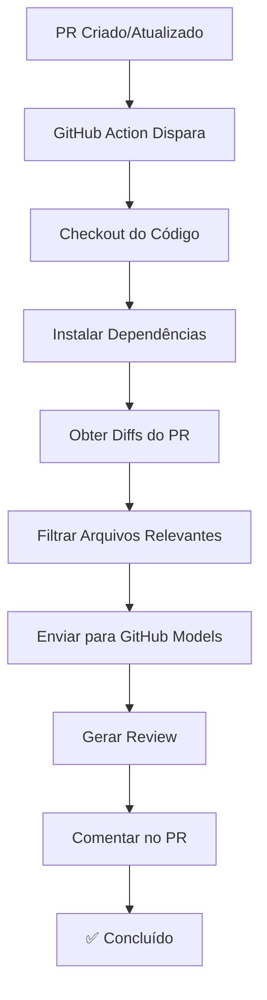

# 🤖 AI Code Review - GitHub Action

Este projeto inclui um sistema automatizado de code review usando GitHub Models que roda automaticamente em Pull Requests.

## 🚀 Como Funciona

1. **Trigger Automático**: A action é executada automaticamente quando:
   - **Pull Request**: Aberto, atualizado ou reaberto nos branches `main` e `developer`
   - **Push Direto**: Commit direto nos branches `main` e `developer`
   - **A cada alteração**: Sempre gera um novo review, independente de reviews anteriores

2. **Análise de Código**: O sistema:
   - Obtém as mudanças do PR (diffs)
   - Filtra apenas arquivos de código relevantes
   - Envia para análise usando GitHub Models
   - Comenta automaticamente no PR com o review

3. **Feedback Inteligente**: A IA analisa:
   - Qualidade do código
   - Bugs potenciais
   - Performance
   - Boas práticas
   - Segurança

## 📋 Pré-requisitos

### 1. Permissões do Repositório
Certifique-se de que o repositório tem as seguintes permissões habilitadas:
- `Actions` habilitado
- `Pull requests` com permissão de escrita

### 2. GitHub Token
O sistema usa dois tokens:
- **`GITHUB_TOKEN`**: Token padrão para comentar no PR
- **`GH_MODELS_TOKEN`**: Personal Access Token para acessar GitHub Models

**Permissões necessárias no PAT:**
- ✅ `repo` - Acesso completo ao repositório
- ✅ `models` - Acesso ao GitHub Models

## 🔧 Configuração

### 1. Arquivos Necessários
Os seguintes arquivos já estão configurados:
- `.github/workflows/ai-code-review.yml` - Workflow principal
- `.github/scripts/ai-review.js` - Script de análise

### 2. Configurar Personal Access Token (PAT)

1. **Criar PAT**: [GitHub Settings → Developer settings → Personal access tokens](https://github.com/settings/tokens)
2. **Permissões**: `repo` e `models`
3. **Adicionar Secret**: Repositório → Settings → Secrets → Actions → `GH_MODELS_TOKEN`

### 3. Dependências
As dependências são instaladas automaticamente:
- `openai` - Cliente para GitHub Models
- `@octokit/rest` - API do GitHub
- `pnpm` - Gerenciador de pacotes

## 🎯 Tipos de Arquivos Analisados

O sistema analisa automaticamente arquivos com as seguintes extensões:
- JavaScript/TypeScript: `.js`, `.jsx`, `.ts`, `.tsx`
- Web: `.html`

*Arquivos deletados são ignorados automaticamente.*

## 📊 Exemplo de Review

Quando um PR é criado ou atualizado, você verá um comentário como este:

```markdown
## 🤖 AI Code Review (Atualizado)

### ✅ Pontos Positivos
- Código bem estruturado e legível
- Uso adequado de TypeScript

### ⚠️ Sugestões de Melhoria
- Considerar adicionar tratamento de erro na linha 15
- A função `calculateTotal` poderia ser otimizada

### 🔍 Detalhes Técnicos
- Performance: O(n²) pode ser otimizado para O(n)
- Segurança: Validação de entrada necessária

---
*Review automático - 01/01/2026 00:00:01*
*Este review é gerado a cada alteração no código*
```

## 🛠️ Personalização

### Modificar o Prompt da IA
Edite o arquivo `.github/scripts/ai-review.js` na seção `system` content:

```javascript
{
  role: "system",
  content: `Seu prompt personalizado aqui...`,
}
```

### Adicionar Novos Tipos de Arquivo
Modifique a regex na linha 34 do script:

```javascript
const isRelevantFile = /\.(js|jsx|ts|tsx|html)$/i.test(file.filename);
```


### Alterar Modelo da IA
Modifique o parâmetro `model` na linha 56:

```javascript
model: "gpt-4o-mini", // ou outro modelo disponível
```

## 🔄 Fluxo de Trabalho


